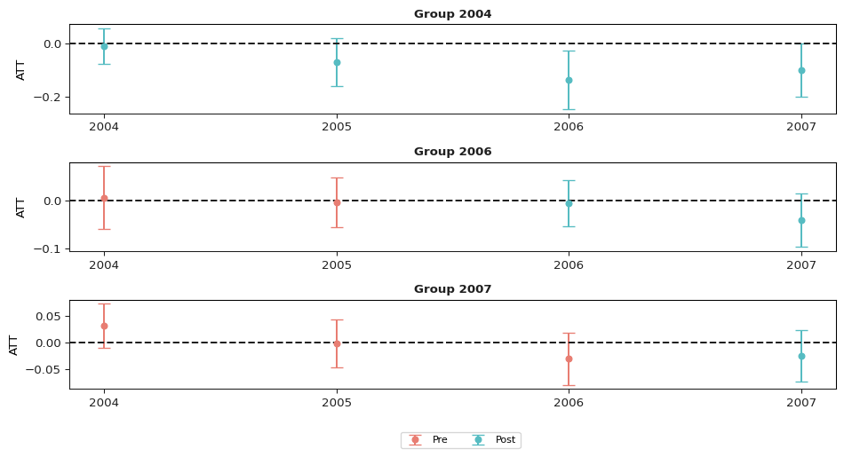

# Difference in Difference in Python

The **csdid** package contains tools for computing average treatment
effect parameters in a Difference-in-Differences setup allowing for

- More than two time periods

- Variation in treatment timing (i.e., units can become treated at
  different points in time)

- Treatment effect heterogeneity (i.e, the effect of participating in
  the treatment can vary across units and exhibit potentially complex
  dynamics, selection into treatment, or time effects)

- The parallel trends assumption holds only after conditioning on
  covariates

The main parameters are **group-time average treatment effects**. These
are the average treatment effect for a particular group (group is
defined by treatment timing) in a particular time period. These
parameters are a natural generalization of the average treatment effect
on the treated (ATT) which is identified in the textbook case with two
periods and two groups to the case with multiple periods.

Group-time average treatment effects are also natural building blocks
for more aggregated treatment effect parameters such as overall
treatment effects or event-study-type estimands.

## Getting Started

There has been some recent work on DiD with multiple time periods. The
**did** package implements the framework put forward in

- [Callaway, Brantly and Pedro H.C. Sant’Anna.
  “Difference-in-Differences with Multiple Time Periods.” Journal of
  Econometrics, Vol. 225, No. 2, pp. 200-230,
  2021.](https://doi.org/10.1016/j.jeconom.2020.12.001) or
  \[arXiv\](https://arxiv.org/abs/1803.09015

This project is based on the original [did R
package](https://github.com/bcallaway11/did).

## Instalation

You can install **csdid** from `pypi` with:

    pip install csdid

or via github:

    pip install git+https://github.com/d2cml-ai/csdid/

### Dependencies

Additionally, I have created an additional library called `drdid`, which
can be installed via GitHub.

    pip install git+https://github.com/d2cml-ai/DRDID

## Basic Example

The following is a simplified example of the effect of states increasing
their minimum wages on county-level teen employment rates which comes
from [Callaway and Sant’Anna
(2021)](https://authors.elsevier.com/a/1cFzc15Dji4pnC).

- [More detailed examples are also
  available](https://bcallaway11.github.io/did/articles/did-basics.html)

A subset of the data is available in the package and can be loaded by

``` python
from csdid.att_gt import ATTgt
import pandas as pd
data = pd.read_csv("https://raw.githubusercontent.com/d2cml-ai/csdid/function-aggte/data/mpdta.csv")
```

The dataset contains 500 observations of county-level teen employment
rates from 2003-2007. Some states are first treated in 2004, some in
2006, and some in 2007 (see the paper for more details). The important
variables in the dataset are

- **lemp** This is the log of county-level teen employment. It is the
  outcome variable

- **first.treat** This is the period when a state first increases its
  minimum wage. It can be 2004, 2006, or 2007. It is the variable that
  defines *group* in this application

- **year** This is the year and is the *time* variable

- **countyreal** This is an id number for each county and provides the
  individual identifier in this panel data context

To estimate group-time average treatment effects, use the
**ATTgt().fit()** method

``` python
out = ATTgt(yname = "lemp",
              gname = "first.treat",
              idname = "countyreal",
              tname = "year",
              xformla = "lemp~1",
              data = data,
              ).fit(est_method = 'dr')
```

Summary table

``` python
# out.summ_attgt().summary2
```

plots

``` python
out.plot_attgt(ylim=(-.25, .1))
```

    C:\Users\Jhon\AppData\Local\Programs\Python\Python38\lib\site-packages\plotnine\layer.py:364: PlotnineWarning: geom_errorbar : Removed 1 rows containing missing values.



    <Figure Size: (640 x 480)>

``` python
out.aggte()
```


    Overall summary of ATT's based on group/cohort aggregation:
       ATT Std. Error  [95.0%  Conf. Int.] 
    -0.031     0.0214 -0.0729       0.0108 


    Group Effects:
       Group  Estimate  Std. Error  [95.0% Simult.   Conf. Band   
    0   2004   -0.0797      0.0384          -0.1549     -0.0046  *
    1   2006   -0.0229      0.0239          -0.0697      0.0239   
    2   2007   -0.0261      0.0288          -0.0824      0.0303   
    ---
    Signif. codes: `*' confidence band does not cover 0
    Control Group:  Never Treated , 
    Anticipation Periods:  0
    Estimation Method:  Doubly Robust

    <csdid.att_gt.ATTgt at 0x1553d29d970>
